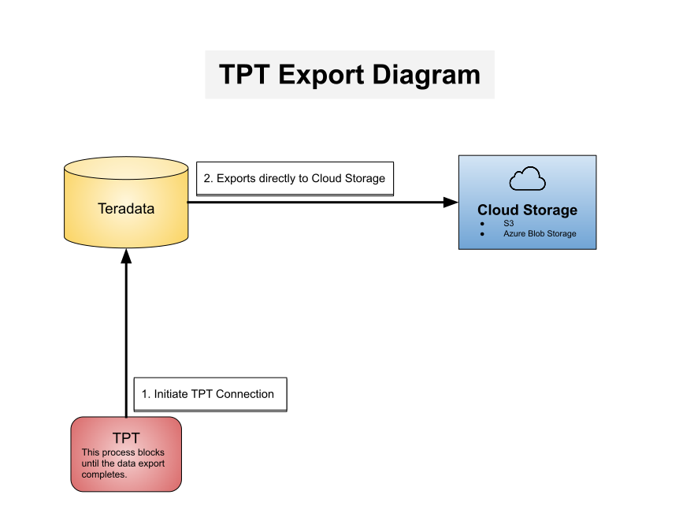

# EasyTPT
Export large data from Teradata the fast & easy way.
> ℹ️ This package was written from a data engineering perspective, with the intent
> to facilitate running one-off data exports along with building Teradata exports into a pipeline.  

## Explanation
If you have ever attempted to query large amounts of data from Teradata using something like JDBC, 
you will discover that it is quite slow. As in, "kick it off tonight and hope it completes by tomorrow" slow.

To address this issue, Teradata created something they call the "Teradata Parallel Transporter" or TPT. 
Here is a [link](https://docs.teradata.com/home) to their documentation. Problem solved, right?

*Well...*

If you're a data engineer trying to bop out a quick pipeline, you may find the process of correctly setting up a
Java environment, finding the right utilities, and figuring out how to use the Teradata Tools & Utilities to be a bit 
more work than you bargained for. Isn't there a better way?

Yes! EasyTPT does all of this for you, and wraps it up in a nice, easy-to-use
[Docker image](https://hub.docker.com/r/dro248/easy_tpt). 🎁

## How TPT Works


TPT works by writing your data directly to the cloud storage of your choice. As such, you will need to provide 
TPT with your cloud storage credentials (along with some other arguments). 

> Note: From a data engineering perspective, this is a really nice feature, especially if the results is
> larger than you expected. No more worrying about disk space! 😅

### Supported Clouds
Teradata supports exporting directly to several major backends. EasyTPT has been implemented
for the following:
- [x] AWS S3
- [x] Azure Blob Storage
- [ ] Google Cloud Platform
- [ ] Kafka
- [ ] and others!


## Usage
> This GitHub repo is for building the Docker images from scratch! If you would like to use the [pre-built Docker image](https://hub.docker.com/r/dro248/easy_tpt) 
> hosted on DockerHub, just use the bash scripts listed below. 

### One-off Exports
EasyTPT acts like a subroutine by accepting all of your parameters as environment variables.
Use one of the following bash scripts as a template (based on your cloud storage):
- [run_s3_export.sh](./run_s3_export.sh)
- `run_azure_export.sh` (coming soon!)

<hr/>

### S3
To begin an EasyTPT export to S3:
- Open the [run_s3_export.sh](./run_s3_export.sh) file and fill in the placeholders with your Teradata, S3, and CSV values
- Run the following in your terminal: `bash run_s3_export.sh`

#### Parameters
The following table will help you fill in the appropriate arguments:
<details>
    
| Value                   | Required? | Description                                                                                  |
|-------------------------|:---------:|----------------------------------------------------------------------------------------------|
| `CLOUD_STORAGE`         |    Yes    | Specifies the type of your cloud storage provider                                            |
| `JOB_NAME`              |    Yes    | A unique name containing alphanumeric characters and no spaces (use underscores)             |
| `AWS_ACCESS_KEY_ID`     |    Yes    |                                                                                              |
| `AWS_SECRET_ACCESS_KEY` |    Yes    |                                                                                              |
| `S3_REGION`             |    Yes    |                                                                                              |
| `S3_BUCKET`             |    Yes    | Ex: 'my-s3-bucket'                                                                           |
| `S3_FILEPATH`           |    Yes    | Ex: 'sales/2020/'                                                                            |
| `S3_FILENAME`           |    Yes    | Ex: 'sales_2021.csv' (uncompressed) or 'sales_2021.csv.gz' (files gzipped individually)      |
| `S3_DONT_SPLIT_ROWS`    |    No     | (Default: `True`) Lets TPT know if it can split files in the middle of a record. (True = no) |
| `WRITE_TO_SINGLE_FILE`  |    No     | (Default: `False`) Lets TPT know if it can write to multiple files. (False = yes)            |
| `SQL`                   |    Yes    | The full text of your SQL as a string (\**see note below)                                    |
| `TERADATA_DATABASE`     |    Yes    |                                                                                              |
| `TERADATA_USER`         |    Yes    |                                                                                              |
| `TERADATA_PASSWORD`     |    Yes    |                                                                                              |
| `FIELD_DELIMITER`       |    No     | (Default: <code>&#124;</code>) CSV field delimiter;                                          |
    
</details>

<hr/>

### Azure
To begin an EasyTPT export to Azure:
- Open the [run_az_export.sh](./run_az_export.sh) file and fill in the placeholders with your Teradata, Azure, and CSV values
- Run the following in your terminal: `bash run_az_export.sh`

#### Parameter Descriptions
The following table will help you fill in the appropriate arguments:
<details>

| Value                   | Required? | Description                                                                                  |
|-------------------------|:---------:|----------------------------------------------------------------------------------------------|
| `CLOUD_STORAGE`         |    Yes    | Specifies the type of your cloud storage provider                                            |
| `JOB_NAME`              |    Yes    | A unique name containing alphanumeric characters and no spaces (use underscores)             |
| `STORAGE_ACCOUNT_NAME`  |    Yes    |                                                                                              |
| `STORAGE_ACCOUNT_KEY`   |    Yes    |                                                                                              |
| `CONTAINER_NAME`        |    Yes    |                                                                                              |
| `FILE_PREFIX`           |    Yes    | Ex: 'sales/2020/'                                                                            |
| `FILENAME`              |    Yes    | Ex: 'sales_2021.csv' (uncompressed) or 'sales_2021.csv.gz' (files gzipped individually)      |
| `CREDS_DIR`             |    Yes    | The creds file containing the `StorageAccountName` and `StorageAccountKey`                   |
| `DONT_SPLIT_ROWS`       |    No     | (Default: `True`) Lets TPT know if it can split files in the middle of a record. (True = no) |
| `WRITE_TO_SINGLE_FILE`  |    No     | (Default: `False`) Lets TPT know if it can write to multiple files. (False = yes)            |
| `SQL`                   |    Yes    | The full text of your SQL as a string (\**see note below)                                    |
| `TERADATA_DATABASE`     |    Yes    |                                                                                              |
| `TERADATA_USER`         |    Yes    |                                                                                              |
| `TERADATA_PASSWORD`     |    Yes    |                                                                                              |
| `FIELD_DELIMITER`       |    No     | (Default: <code>&#124;</code>) CSV field delimiter;                                          |
    
</details>

<hr/>

> ****Note from the Author**: Passing in the contents of a SQL file as an environment variable may seem ugly. 
> In fact, the first few iterations of EasyTPT used Docker volumes. However, if you have ever needed to attach volumes 
> to a Docker container from an Airflow DAG running on Kubernetes instance (like I was), you will understand that the 
> whole ordeal is a painful mess.

### Airflow Kubernetes Operator
```python
from airflow.providers.cncf.kubernetes.backcompat.backwards_compat_converters import convert_env_vars
from airflow.providers.cncf.kubernetes.operators.kubernetes_pod import KubernetesPodOperator

with open('sales_2021.sql', 'r') as sql_file:
    sales_sql_query = sql_file.read()

KubernetesPodOperator(
    task_id="sales_2021_tpt_export",
    name="sales-2021-tpt-export",
    namespace="default",
    image="dro248/easy_tpt:latest",
    env_vars=convert_env_vars({
        "JOB_NAME": "SALES_2021",
        "CLOUD_STORAGE": "S3",
        "SQL": sales_sql_query,
        
        # S3 creds & info
        "AWS_ACCESS_KEY_ID": "<placeholder>",
        "AWS_SECRET_ACCESS_KEY": "<placeholder>",
        "S3_BUCKET": "<placeholder>",
        "S3_REGION": "<placeholder>",
        "S3_FILEPATH": "teradata/sales/",
        "S3_FILENAME": "sales_2020.csv.gz",
        
        # Teradata creds
        "TERADATA_DATABASE": "<placeholder>",
        "TERADATA_USER": "<placeholder>",
        "TERADATA_PASSWORD": "<placeholder>",
        
        # CSV parsing
        "S3_DONT_SPLIT_ROWS": "True",
        "WRITE_TO_SINGLE_FILE": "False",
        "FIELD_DELIMITER": "|",
    }),
    get_logs=True,
    service_account_name="airflow",
    is_delete_operator_pod=True,
    in_cluster=True,
    image_pull_policy="Always",
)
```

## ⚠️ Warnings and FAQs 🔍  (PLEASE READ)
TPT has some sharp edges that you should know about. A few of them are listed below.

### Warning: Do not use Single-Line Comments.
Behind the scenes, TPT strips newlines characters from your SQL query, effectively putting it all on a single line. 
You can see how a single-line comment embedded somewhere in the middle of your query could wreak havoc.

**Solution:** _Convert your single-line comments to multi-line comments._

This will raise an error:
```sql
SELECT
    ID,
    --FIRST_NAME,
    LAST_NAME
FROM CUSTOMERS;
``` 

This will work just fine:
```sql
SELECT
    ID,
    /*FIRST_NAME,*/
    LAST_NAME
FROM CUSTOMERS;
``` 

### Warning: TPT doesn't add column headers to your CSVs.
Unfortunately, TPT does not have a setting to enable this. On the bright side, you have the SELECT statement that
generated it, so you already know the name and order of everything, right? 🤦

### Warning: Make sure EasyTPT has a fast connection to Teradata
While exported data will be written to your cloud storage, we've found that in practice, running EasyTPT via a slow VPN connection
can *dramatically* slow the export process. To ensure a good/timely user experience, make sure that EasyTPT is running from a 
server/cluster with a fast connection to your Teradata instance.

### Q: I am getting a "name not in HOSTS file or names database" message. What does that mean?   
A: For security purposes, Teradata gives database admins the ability to block access / TPT usage from 
unexpect locations and roles. If this is your first time using TPT, this message just means that you need to ask 
your Teradata administrator to whitelist your IP address or grant TPT access to your role. 
(Alternatively, you have just forgotten to connect to your corporate VPN.)

### Q: How can I be sure that EasyTPT is secure?
A: The code is open-source [see license](./LICENSE). Feel free to inspect, add, or remove any part of it. Happy coding! 
